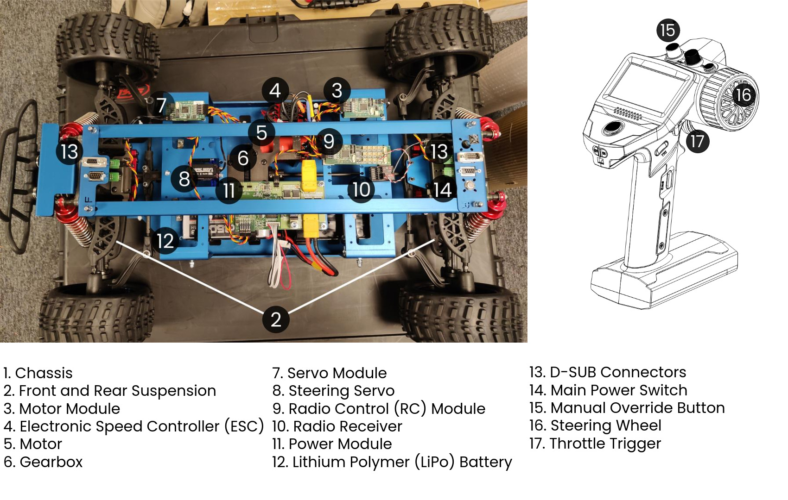
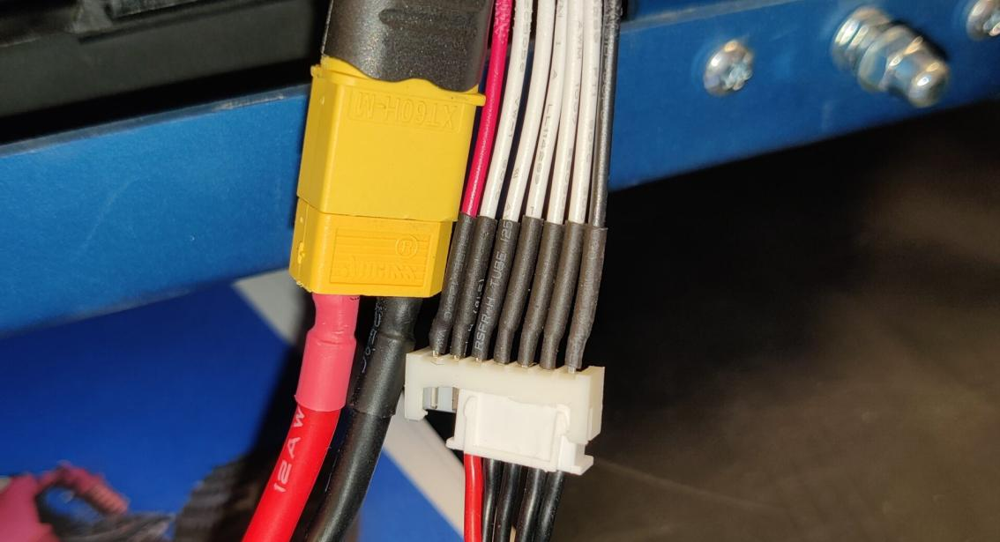

# Getting Started

The Rover is a sophisticated 1:5 scale model car designed for educational, research, and prototyping applications. This guide provides an overview of the Rover’s internal components and the Radio Control (RC) system, equipping you with the knowledge needed to effectively utilize this platform. Further, the guide walks you through the procedures for first-time setup and operation of the Rover.

This guide assumes the reader has an understanding of basic electrical concepts such as voltage and current, as well as how to handle batteries safely. It is important to remember that the Rover is not a toy. Faulty wiring or incorrect connections can cause personal injuries, property damage or start a fire. CanEduDev assumes no responsibility in the event damages occur due to incorrect handling.

## Inside the Rover

### Component Overview

Before we begin, look at the image below. It shows a Rover with the components marked with numbers. We are going to go over each component's purpose, followed by a short description of how the system interacts. This information is important to understand as it will be a tremendous help when working with the Rover and understanding the rest of the documentation.

{ loading=lazy }

### Control Modules

The Rover has four control modules, each with its own responsibilities: the Power Module, the Servo Module, the Motor Module, and the RC Module. The modules are connected via a Controller Area Network (CAN) bus. They use the bus to share information and to send and receive control signals, such as steering angle and vehicle speed.

### Radio Control System

The Rover comes equipped with a Radio Control (RC) System, which enables remote control. The system is composed of a Radio Transmitter and a Radio Receiver. The transmitter sends control signals to the receiver, which in turn transmits them to the RC module in the Rover, converting the signals into CAN control commands for the rest of the system.

### Power Distribution

In its default configuration, the Rover is powered by a single LiPo Battery. The battery connects to the Power Module, which manages the distribution of electrical power to all onboard components. It also provides current and voltage monitoring as well as safety features to protect the Rover's modules and the battery. The power to the module, and by extension to the whole system, is turned on and off using the Main Power Switch.

### Steering System

The Servo Module acts as a smart interface to the steering servo, which turns the front wheels. The module interprets CAN steering commands and adjusts the steering servo accordingly. It also regulates the steering servo's voltage and monitors its power consumption.

### Drive System

The Motor Module acts as a smart interface to the ESC, and by extension the Motor. It interprets CAN driving commands and translates them into signals the ESC can understand. In turn, the ESC controls the motor's rotational speed and direction by regulating the voltage and current supplied to the motor. This enables forward drive, braking, and reversing of the Rover. The motor's rotational power is transferred to the Gearbox, where it is distributed evenly to all four wheels of the Rover.

### Mechanical Components

While driving, the Suspension ensures the wheels are in contact with the surface even on uneven terrain and bumps. The Chassis provides the Rover with structural stability and support, while also providing room for mounting the onboard components.

### External Connectivity

The Rover comes equipped with two D-SUB connectors, which are used to interface with the Rover. They provide external components with power from the battery and allow them to access the CAN bus as well.

## Installing the LiPo Battery

/// note | Supported Batteries
The Rover supports 2S-4S LiPo batteries, however 4S is recommended for best performance.
///

When you first unpack the Rover, there are some things to keep in mind. First of all, there is no battery inside the Rover or the radio transmitter, which you need to provide yourself. We recommend a 4S LiPo battery with an XT60 connector to mount inside the Rover. The transmitter uses 4 regular AA batteries. To install the LiPo battery, you need to remove the top cover of the Rover, which is mounted using dome nuts on the top and sides of the car. When the cover is removed, you should be able to see the battery slot, where the battery can be mounted.

Before connecting the battery to the power module for the first time, the Rover should be placed on top of a box with its wheels suspended in the air, so as to make sure that the system can be tested without danger to your surroundings. Once the Rover is placed properly, connect both battery connectors to the power module as shown in the image.

{ width="400" loading=lazy }

Press the main power switch to start the system. This should light up various green LED lights in the Rover. Some Rover models come with an ESC with a separate power switch. Once the Rover is powered, that switch needs to be pressed to be able to drive the motor.

To turn off the Rover, simply press the main power switch again. This will turn off all components. 

## Testing the RC system

The first time you are using the transmitter, make sure the Rover is once again placed so the wheels can move freely in the air, then start the Rover and the transmitter.

To steer right, rotate the steering wheel on the transmitter clockwise. To steer left, rotate the wheel counter-clockwise. To accelerate forward, push the throttle stick away from the transmitter’s handle. While the car drives forward, the throttle stick can be pulled back towards the handle to brake. When the car is in standstill, it is also possible to reverse by pulling the throttle stick towards the handle again. Make sure to familiarize yourself with the controls while the wheels are in the air to make sure you understand how the Rover is driven.

## Storing the Rover

When the Rover is not in use, make sure to turn off the power using the main power switch to not drain the battery. If the Rover is going to be inactive for more than a couple of hours, make sure to disconnect the LiPo battery from the power module, to avoid discharging the battery too much and causing irreparable damage to it. When moving or shipping the Rover, make sure to use the included carrying case for adequate protection. The case has removable foam fillers, allowing you to store any additional accessories you might need to keep together with the Rover, such as the RC system or the LiPo batteries.

## Note on LiPo batteries

Lithium Polymer (LiPo) batteries are widely used due to their high energy density and lightweight properties, making them an excellent choice for the Rover. However, they require careful handling to ensure safety and longevity.

One critical aspect of LiPo battery care is monitoring the discharge levels. LiPo batteries should never be discharged below 3.0 volts per cell, as this can lead to irreparable damage. Over-discharging a LiPo battery can cause a significant drop in capacity and performance, and in some cases, it can render the battery completely unusable. 

To prevent over-discharging, it is recommended to use a LiPo battery voltage monitor or a low voltage alarm. The Rover comes equipped with a low-voltage cutoff feature in the power module which is enabled by default. When the voltage is deemed too low, the power module will turn off most systems to protect your battery from damage. 

Always store LiPo batteries at a safe voltage level, typically around 3.7 to 3.8 volts per cell. If you plan to store the battery for an extended period, use a storage mode on your charger to set the battery to the appropriate voltage. Proper storage helps maintain battery health and extends its usable life. 

By following these guidelines, you can ensure the longevity and performance of your LiPo batteries, keeping your Rover running smoothly and safely.
