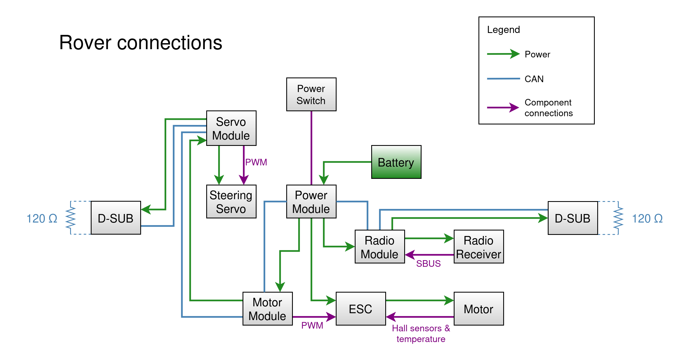

# The Rover’s System
We have already given a simplified overview of the system’s components in the [Getting Started](index.md) section, however this section contains a more detailed description of the Rover’s system. It will give you an understanding of how the system is built, the purpose of each component, as well as the tools needed to modify the system.

## Mechanical Components
The Rover's mechanical components are engineered for robust and reliable performance, catering to a variety of technical applications. Below is a detailed examination of its key mechanical elements.

### Suspension
The Rover is equipped with an advanced suspension system designed to maintain stability and smooth handling across diverse terrains. This system incorporates adjustable shocks and springs, allowing fine-tuning for optimal performance on different surfaces. The tunability of the suspension system makes it suitable for a wide range of research and prototyping applications, enabling customization to simulate various driving conditions.

### Modular Aluminum Chassis
The chassis of the Rover is constructed from high-grade aluminum, providing a balance between strength and lightweight properties. Its modular design facilitates easy modifications and upgrades, making it particularly advantageous in research and educational settings where frequent adjustments or replacements of components are necessary. The chassis serves as a robust foundation for all other components, ensuring both durability and longevity.

### Gearbox
The Rover features a four-wheel-drive (4WD) gearbox that ensures even power distribution to all wheels, enhancing traction and control. This configuration allows the Rover to effectively navigate various driving conditions. The gearbox is designed for efficiency and durability, ensuring smooth power transmission from the motor to the wheels. Comprehensive understanding of the gearbox mechanics is essential for performing modifications or maintenance tasks.

### Ackermann Steering
The Rover utilizes an Ackermann steering mechanism to improve maneuverability by ensuring correct wheel alignment during turns. This system minimizes tire wear and enhances steering precision, making it critical for applications that demand precise control and handling. Adjusting the steering linkage and angles can fine-tune the Rover's responsiveness, making it adaptable for various experimental setups.

## Electromechanical Components
The electromechanical components of the Rover are critical to its functionality and performance. This section provides a detailed examination of the Brushless DC (BLDC) motor, the Electronic Speed Controller (ESC), and the steering servo.

### BLDC Motor
The Rover is equipped with a high-performance BLDC motor, serving as the primary source of propulsion. BLDC motors are favored for their efficiency, reliability, and low maintenance requirements. Key attributes of the BLDC motor include a high power-to-weight ratio, delivering the necessary torque and speed for the Rover. Its efficient operation is characterized by reduced electrical and mechanical losses, ensuring optimal performance across a wide range of speeds and loads. The absence of brushes minimizes wear and tear, enhancing the motor's durability. Additionally, the design of the BLDC motor allows for precise control of speed and torque, which is essential for research and prototyping applications.

### ESC
The ESC is a pivotal component that manages the power supply to the BLDC motor. It interprets signals from the motor module and adjusts the motor’s speed accordingly. The ESC regulates the current and voltage supplied to the motor, ensuring stable and efficient operation. Integrated braking mechanisms within the ESC allow for controlled deceleration and stopping, which is crucial for safety and maneuverability. Furthermore, the ESC includes thermal protection features to prevent overheating, safeguarding both the motor and the ESC itself. Many ESCs offer programmable settings, allowing users to customize parameters such as throttle response, braking strength, and cutoff voltage for the LiPo battery.

### Steering Servo
The steering servo is responsible for the precise control of the Rover's steering mechanism, converting electrical signals from the RC system into mechanical movements. It must provide sufficient torque to turn the wheels while maintaining quick response times for accurate steering. High-resolution servos ensure fine control over wheel angle adjustments, which is essential for precise maneuvering. Designed to withstand the stresses of steering, the servo is built for longevity and consistent performance. Some advanced servos include feedback mechanisms that provide positional data, enabling closed-loop control systems for enhanced accuracy.

## Electronic Components
The electronic architecture of the Rover is meticulously designed to ensure modularity, flexibility, and ease of use. This section provides an in-depth look at the electronic components and their configurations, explaining the background, concept, and practical implementation.

### Background and Concept
The Rover’s electronic components are based on a modular board architecture. A CPU board and a carrier board combine to form a general purpose board. A general purpose board is then combined with a software application to construct a module. This approach allows a carrier board providing a specific functionality to be reused to create different modules. The benefits of this approach include:

- Modularity: Each module can be independently developed, tested, and replaced, facilitating easier maintenance and upgrades.
- Flexibility: Users can customize the Rover by adding or removing modules according to their specific needs.
- Scalability: The architecture supports the addition of new modules, allowing for future expansions and enhancements.
- Freedom: Since board schematics and module software are free and open, users can design their own carrier boards and develop new modules.

### Boards
At the heart of the Rover's modules is the CPU board based on the STM32F302 microcontroller. All of the Rover’s modules use this CPU board as a foundational building block, as it provides essential peripherals such as UART, CAN, and SWD interfaces. Additionally, it includes SPI flash memory for storing application data.

A CPU module cannot function on its own, as it is powered by its carrier board. Currently, there are three different carrier boards available:

- Power Carrier Board: This board provides functionality for monitoring and controlling voltages and current. It also offers safety features such as a 100A fuse, customizable overcurrent protection, and reverse polarity protection. It is equipped with connectors commonly used in interfacing with components from the hobby market, such as ESCs and servos.
- Servo Carrier Board: This board has a Pulse Width Modulation (PWM) interface and a motor driver to control various servos and motors. It can regulate the voltage output to the servos and has a sensor port to collect feedback from the connected component. Furthermore, it has SPI and I2C ports to interface with external components.
- IO Carrier Board: This board has connectors for different types of IO, such as analog sensors and switches. It can collect signals and control digital devices using its GPIO ports. Like the servo board, it also features SPI and I2C interfaces.

### Modules
By combining a board and an application, we can create the modules that power the Rover. There are four base modules included with all Rover setups. These are:

- Power Module: Based on the CPU board and the power board, this module manages the distribution and regulation of electrical power to all components of the Rover. It includes voltage regulators, current sensors, and safety features to ensure a stable power supply and protect against overvoltage or overcurrent conditions.
- Servo Module: This module controls the steering servo, translating signals from the CAN bus into PWM signals for the steering servo. It manages the servo's position and ensures accurate steering control. Additionally, it regulates the servo’s voltage and monitors its current usage.
- Motor Module: Responsible for controlling the ESC, this module takes signals from the CAN bus and translates them into PWM signals for the ESC, which adjusts the motor's speed and torque accordingly.
- Radio Control (RC) Module: Serving as the communication interface between the Rover and the RC system, this module receives output signals from the radio receiver and translates them into CAN commands for the other modules. The IO board provides the necessary input/output interfaces to connect to the RC receiver. It also provides a CAN-controllable buzzer for use by the other applications; for example the power module uses it to signal when the battery needs to charge.

In addition, there are extra modules available that augment the Rover's functionality:

- Wheel Speed Module: Uses a servo board and provides wheel speed data.
- FlexiRange: Provides adjustable ranging using four ultrasonic sensors connected to an IO board.
- Light Array: Provides CAN-controllable LED lights through an IO board connected to four LED lights.

This modular and flexible design ensures that the Rover can be easily customized and expanded, providing a robust platform for various applications and future enhancements.

## System Architecture
To combine the mechanical, electromechanical and electronic components, the Rover’s system needs to be wired a certain way. Below is the wiring diagram for the Rover’s power connections, CAN connections and component connections.

{ loading=lazy }

## Software

The Rover's software architecture is designed to be robust, flexible, and open for customization. By leveraging open-source tools and libraries such as the STM32F3 Hardware Abstraction Layer (HAL) and FreeRTOS, it provides a comprehensive framework for controlling and extending the Rover's capabilities. Hosted on GitHub, the software is accessible for users to review, modify, and contribute to, ensuring transparency, fostering community collaboration, and accelerating development. The source code is available at https://github.com/CanEduDev/rover, where users can clone the repository, submit issues, and contribute through pull requests.

The software consists of firmware for the modules and integration tests. The firmware is written in the C language and tested using a combination of C for unit tests and Python programs for integration testing. There are also shell scripts for bootstrapping the build environment, running code formatting and linting, and performing static analysis of the code.

### Firmware

Each module has its own firmware, which consists of a bootloader and an application. The bootloader is the same for all firmware and provides firmware update functionality through CAN. The application provides the modules with their main functionality.

The firmware is built on the STM32F3 HAL and FreeRTOS libraries. STM32F3 HAL is a common library provided by STMicroelectronics that simplifies the configuration and control of the STM32F3 microcontroller. It abstracts the low-level hardware details and provides a standardized API for programming the CPU board. The HAL includes drivers for various peripherals, such as GPIO, I2C, SPI, and ADC.

FreeRTOS is a market-leading real-time operating system that manages the execution of tasks on the CPU board. It provides essential features such as task scheduling, inter-task communication, and timing services. Using FreeRTOS allows the Rover's software to handle multiple concurrent processes efficiently, ensuring responsive and reliable operation.

As the various modules have a lot of hardware in common, there are software libraries for shared functionality. For instance, there is a library that handles CAN communication, libraries providing base system initialization functionality, and drivers for integrated circuits such as SPI flash. These libraries are utilized by both the bootloader application and the main application. This modular architecture enables ease of development and maintenance, allowing users to extend or modify the Rover’s functionality by updating specific drivers or application code without affecting the entire system.

### Distributed Embedded Control System

The Rover’s control system is a Distributed Embedded Control System (DECS). A DECS is a control system composed of several modules, each with a dedicated control function, where the modules communicate with each other over a network. In the Rover’s case, the power module is responsible for power control, the servo module is responsible for steering, the motor module is responsible for the motor, and the RC module is responsible for radio communication. The modules exchange information over a CAN bus. For an excellent introduction to CAN, see Kvaser’s resources on the topic, such as the https://kvaser.com/can-protocol-tutorial/.

Not only does the CAN system allow the Rover’s modules to communicate internally, it is also exposed through the D-SUB connectors, allowing the user to gather information from the Rover’s system, control it directly, and configure the system to fit their needs. Most of the Rover’s settings can be adjusted through the CAN bus. It is possible to set a custom low-voltage cutoff limit, overcurrent limit, PWM frequency, servo voltage, and other parameters.

A common way to work with CAN systems is to use a CAN database file (DBC), which is included in the Rover’s software. The DBC file defines all the CAN messages in the system as well as the signals contained in each message. Software that interfaces with the CAN system can use the DBC file to know which ID each message has, which node in the system sends it, and how to interpret the values in the message.
