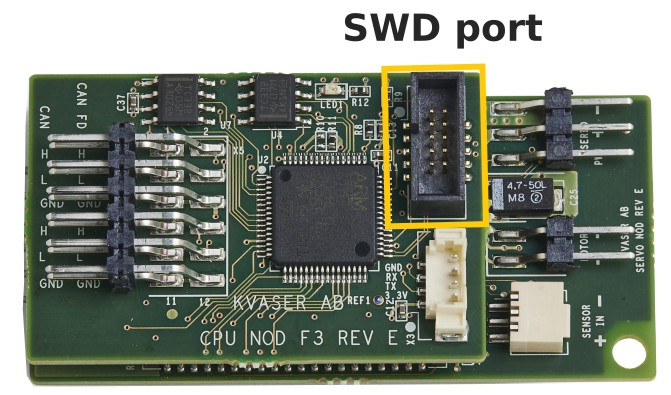
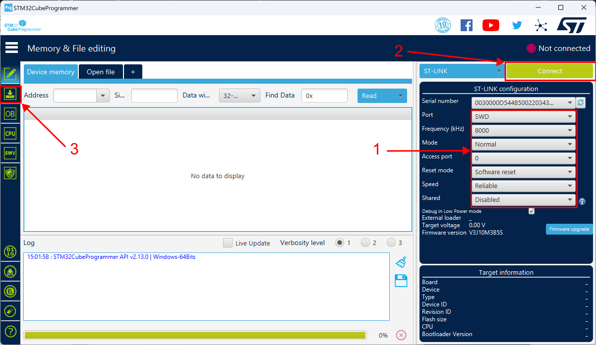
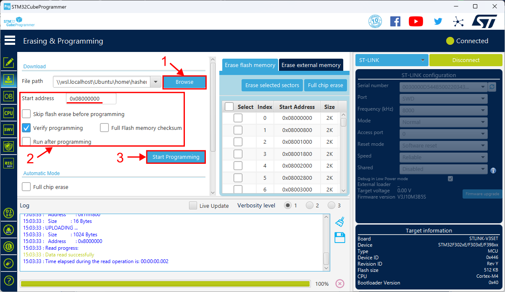

# Upgrading the Firmware

Fully assembled Rovers come with the latest version of the software by default. However, we are continuously working to improve the product which means sometimes you may want to upgrade your software. This guide explains the process.

## Overview

The Rover's software upgrade process consists of two steps:

1. Flashing the firmware
1. Flashing the configuration

Flashing the firmware can be performed in two different ways: either through the Serial Wire Debug (SWD) interface of each module, or through CAN. We recommend users use the CAN method, however the SWD method is required if you also want to upgrade the bootloader.

Flashing the configuration can only be done through CAN.

If you just want to upgrade your existing system, refer to [Flashing Over CAN](#flashing-over-can). If you need to provision a new module or upgrade the bootloader, refer to [Flashing Over SWD](#flashing-over-swd).

   
## Flashing over CAN

### Prerequisites

* CAN interface with SocketCAN, or Kvaser CAN interface, for example [Kvaser Leaf](https://kvaser.com/product/leaf-v3/) with [Kvaser CANlib and Kvaser Drivers](https://kvaser.com/download/)   
* Python v3.7 or later

### Step-by-step Instructions

1. Download the Rover binaries from the Rover GitHub repository and unzip it. Link: [Rover Releases](https://github.com/CanEduDev/rover/releases)

1. Power on the Rover by connecting the battery and pressing the power switch. LEDs on the boards should light up.  

1. Flash the configuration files over CAN using a CAN interface: connect the interface to the Rover’s D-SUB port, then navigate to the release folder.

    ```bash
    # Replace v0.14.0 with the version you downloaded in step 1
    cd rover-release-v0.14.0
    ```

1. Check communication with the system.

    /// details | SocketCAN Command
        type: note

    ```bash
    python3 fw_update.py -i socketcan -c can0 list
    ```
    ///

    /// details | Kvaser Command
        type: note

    ```bash
    python3 fw_update.py -i kvaser -c 0 list
    ```
    ///

1. Update the firmware. This will write firmware and configuration for all boards in the system.

    /// details | SocketCAN Command
        type: note

    ```bash
    python3 fw_update.py -i socketcan -c can0 system
    ```
    ///

    /// details | Kvaser Command
        type: note

    ```bash
    python3 fw_update.py -i kvaser -c 0 system
    ```
    ///

1. Restart the Rover by turning it off, waiting 5 seconds then turning it on again. Now, you should have a working Rover.


## Flashing Over SWD

### Prerequisites 

* [STLINK-V3SET](https://www.st.com/en/development-tools/stlink-v3set.html)  
* [STM32CubeProgrammer](https://www.st.com/en/development-tools/stm32cubeprog.html)  
* CAN interface with SocketCAN, or Kvaser CAN interface, for example [Kvaser Leaf](https://kvaser.com/product/leaf-v3/) with [Kvaser CANlib and Kvaser Drivers](https://kvaser.com/download/)   
* Python v3.7 or later

### Step-by-step Instructions

1. Download the Rover binaries from the Rover GitHub repository and unzip it. Link: [Rover Releases](https://github.com/CanEduDev/rover/releases)

1. Connect the STLINK-V3SET to your computer using a USB cable.  

1. Start STM32CubeProgrammer.  

1. Power on the Rover by connecting the battery and pressing the power switch. LEDs on the boards should light up.  

1. Connect the 10-pin SWD cable of the STLINK to the servo module that is connected to the steering servo. 

    { width=300 loading=lazy }

1. Connect to the module using STM32CubeProgrammer.

    { loading=lazy }

1. Select the “servo-with-bootloader.bin” binary file, check the box “Verify programming”, set the start address to `0x08000000` and click "Start Programming".

    { loading=lazy }

1. Repeat for all the other modules. Below is the list of modules and their binaries. 

    | Module | Binary |
    |--------|--------|
    | Light Array Module | `light-array-with-bootloader.bin` |
    | Motor Module | `motor-with-bootloader.bin` |
    | Obstacle Detector Module | `obstacle-detector-with-bootloader.bin` |
    | Power Module | `battery-monitor-with-bootloader.bin` |
    | Radio Module | `sbus-receiver-with-bootloader.bin` |
    | Servo Module | `servo-with-bootloader.bin` |
    | Wheel Module | `wheel-with-bootloader.bin` |

1. Flash the configuration files over CAN using a CAN interface: connect the interface to the Rover’s D-SUB port, then navigate to the release folder.
    ```bash
    # Replace v0.14.0 with the version you downloaded in step 1
    cd rover-release-v0.14.0
    ```

1. Check communication with the system.

    /// details | SocketCAN Command
        type: note

    ```bash
    python3 fw_update.py -i socketcan -c can0 list
    ```
    ///

    /// details | Kvaser Command
        type: note

    ```bash
    python3 fw_update.py -i kvaser -c 0 list
    ```
    ///

1. Update the firmware. This will write firmware and configuration for all boards in the system.

    /// details | SocketCAN Command
        type: note

    ```bash
    python3 fw_update.py -i socketcan -c can0 system --skip-binaries
    ```
    ///

    /// details | Kvaser Command
        type: note

    ```bash
    python3 fw_update.py -i kvaser -c 0 system --skip-binaries
    ```
    ///

1. Restart the Rover by turning it off, waiting 5 seconds then turning it on again. Now, you should have a working Rover.  