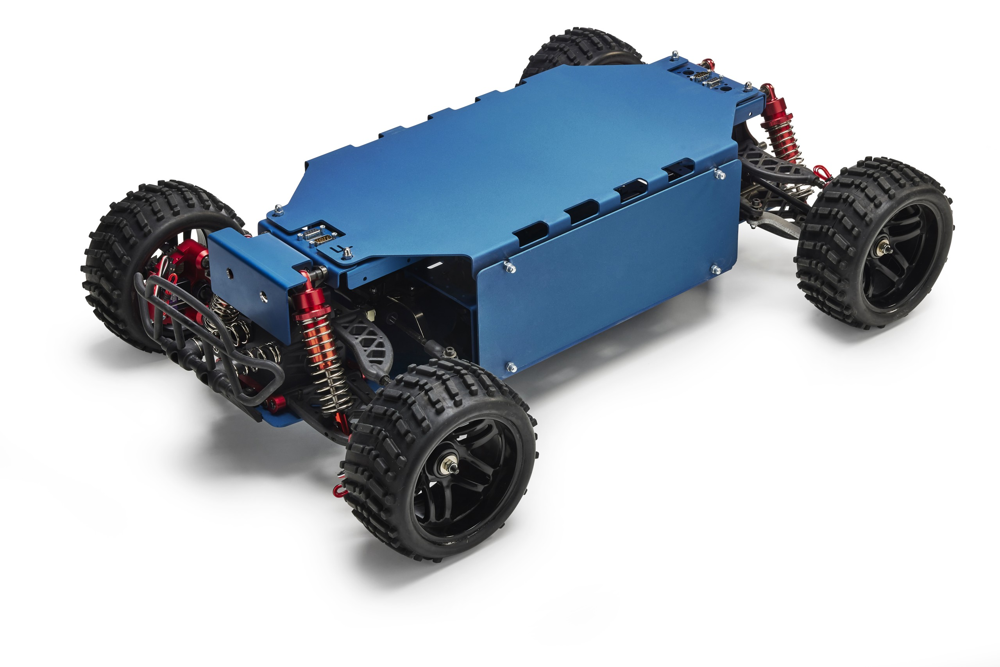

# Rover Documentation

{ align="right" width="300" loading=lazy }

Welcome to the complete documentation for the **CanEduDev Rover** platform!

This documentation covers everything you need to know about the Rover system, from getting started to advanced development topics.

## What is the Rover?

The Rover is a distributed embedded system platform designed for education and development in the field of CAN-based communication and real-time control systems. It features:

- **Distributed Control System**: Multiple STM32F302 microcontrollers communicating via CAN bus
- **Real-time Operation**: FreeRTOS-based firmware
- **CAN Kingdom Protocol**: Customizable CAN protocol for control, configuration and software updates
- **ROS2 Integration**: Gateway for high-level control and monitoring
- **Python Tools**: Comprehensive development and testing utilities

## Documentation Structure

This documentation is split into different sections depending on area of interest, presented below. You can also search the complete documentation using the search bar at the top of the page. If you feel the documentation is missing information, please reach out to [support@canedudev.com](mailto:support@canedudev.com) or join our [Discord](https://discord.gg/r45d624Tan).

-   :material-rocket-launch:{ .lg .middle } __Getting Started__

    ---

    We recommend you start here to learn about the platform

    [:octicons-arrow-right-24: Getting Started](getting-started/index.md)

-   :material-help-circle:{ .lg .middle } __Frequently Asked Questions__

    ---

    Our frequently asked questions page

    [:octicons-arrow-right-24: FAQ](faq/index.md)

-   :material-network:{ .lg .middle } __CAN Reference__

    ---

    Everything related to the Rover's CAN protocol

    [:octicons-arrow-right-24: CAN Reference](can/index.md)

-   :material-dots-grid:{ .lg .middle } __ROS2 Reference__

    ---

    Everything related to the Rover's ROS2 integration

    [:octicons-arrow-right-24: ROS2 Reference](ros2/index.md)

-   :material-download:{ .lg .middle } __Resources__

    ---

    Downloadable resources such as data sheets, manuals and schematics

    [:octicons-arrow-right-24: Resources](resources/index.md)

