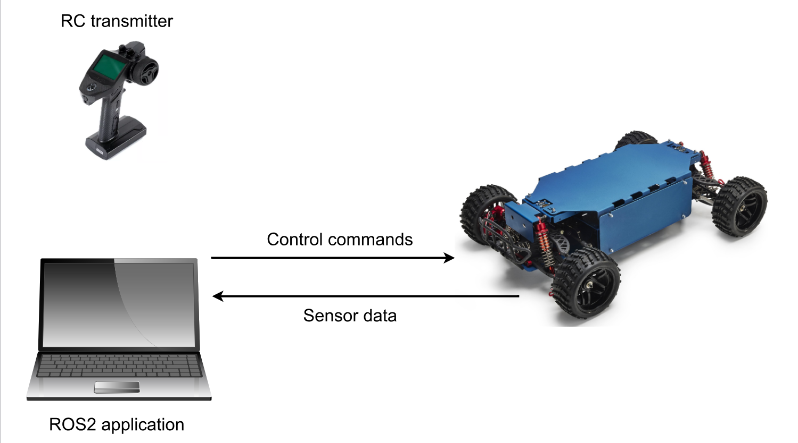
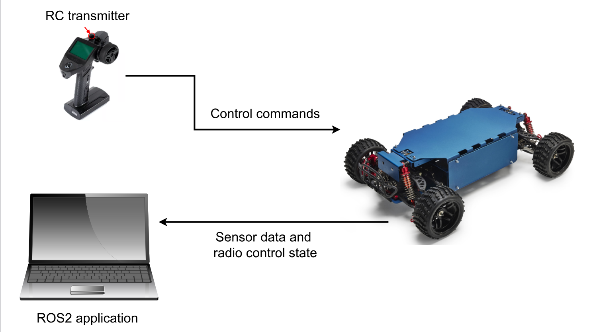

# Safety Architecture

The ROS2 gateway implements a sophisticated safety mechanism with human override capability.

## Safety Override System

The system implements a priority-based control architecture:

- **Autonomous/Manual Control Priority**: User publishes `Twist` messages on the `/rover/cmd_vel` topic.
- **Radio Monitoring**: The controller node monitors CAN bus activity to detect radio presence. If the radio is present, it doesn't interfere with the control. Otherwise, it sends CAN messages to control the Rover.
- **Fail-safe**: If radio connection is lost, this triggers a system stop and the Rover halts.
- **Radio Command Publishing**: Radio commands are published to `/rover/radio/cmd_vel` for monitoring by the user.

## Control Flow

The following images illustrate the control flow and radio override logic:

1. Override button is released, and ROS control is enabled.
{width=500  loading=lazy }

1. Override button is pressed and control is taken over by the radio.
{width=500 loading=lazy }

When no physical radio is active (first image):

1. User sends commands via `/rover/cmd_vel`
1. Controller node forwards commands to CAN bus
1. Rover executes commands

When physical radio is active (second image):

1. Radio module sends commands from RC transmitter directly via CAN bus
1. Controller node reads these CAN messages 
1. Controller node publishes radio commands to `/rover/radio/cmd_vel` for monitoring
1. Controller node ignores any `/rover/cmd_vel` commands
